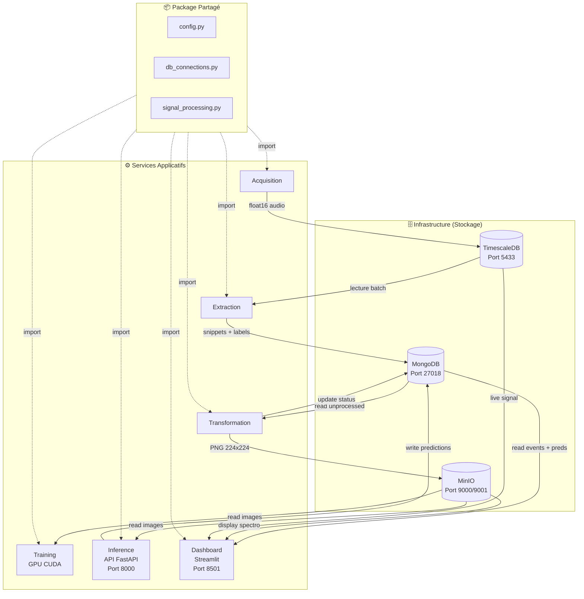

# 🔍 Audit du Projet "The Bubble Project"

**Version** : Architecture v2.2 (Signal physique réaliste + cache prédictions)

## ✅ Problèmes Résolus (Mai 2026)

### 1. Génération de signal trop triviale à classer
*   **Problème**: Les paramètres physiques `(freq, intervalle, chaos)` étaient des **points fixes** par classe avec aucun chevauchement. Chaque feature seule séparait les 5 classes (freq 800→1200Hz monotone, densité 1.25→4 bulles/s monotone, noise std 0.01→0.11 monotone). Un humain distinguait 40 et 80 trivialement à l'œil sur le signal brut, et le CNN convergeait artificiellement à ~100% sans rien apprendre.
*   **Solution**: Réécriture de `generate_signal()` :
    *   Chaque classe est désormais une **distribution gaussienne** (moyennes + écarts-types) et non un point fixe. Les distributions de classes adjacentes **se chevauchent**.
    *   Paramètres tirés stochastiquement à **chaque bulle** : fréquence, décroissance, amplitude, nombre d'harmoniques (1 à 4).
    *   Bruit de fond **rose (1/f)** au lieu de blanc — plus réaliste pour de la turbulence d'écoulement.
    *   Possibilité de **double-burst** (cavitation jumelée), probabilité croissante avec le bouchage.
    *   Bruit de label optionnel via `LABEL_NOISE_RATE` pour simuler les erreurs capteur.

### 2. Cache des prédictions
*   **Problème**: Le dashboard appelait l'API inference à **chaque refresh (1 s)** pour la même bulle, même quand la prédiction avait déjà été calculée.
*   **Solution**: L'API `/predict/{bubble_id}` lit puis écrit la prédiction dans MongoDB. Le dashboard lit le cache Mongo en priorité et n'appelle l'API que pour les bulles non encore prédites.

### 3. Auto-reload du modèle dans l'inference
*   **Problème**: Le modèle était chargé une seule fois au boot. Si Inference démarrait avant la fin du Training, il restait en mode dégradé indéfiniment.
*   **Solution**: Watcher asynchrone qui surveille le `mtime` du `.pth` toutes les 5 s et recharge à chaud.

### 4. Bugs PyTorch / data augmentation
*   `torch.cuda.amp.GradScaler()` / `torch.cuda.amp.autocast()` → API non-deprecated `torch.amp.GradScaler("cuda")` / `torch.amp.autocast("cuda")`.
*   Suppression de `RandomHorizontalFlip` sur les spectrogrammes : flip horizontal = inverser le temps, ce qui transforme une attaque exponentielle en queue exponentielle (signal physiquement impossible).
*   `BubbleDataset.__getitem__` retournait silencieusement `(zeros, label=0)` en cas d'erreur S3, polluant le training. Remplacé par un skip vers l'échantillon suivant.

### 5. Stabilité Flux Temps Réel (correctif antérieur)
*   Détection de gap temporel : après 10 tentatives infructueuses, saut au temps présent.
*   Démarrage sans checkpoint : `NOW - 30s` au lieu de scanner l'historique.

### 6. Performance Dashboard (correctif antérieur)
*   `BATCH_DURATION` extraction : 10 s → 1 s.
*   Timeout API Inference : 5 s → 0.5 s.

---

## 📋 Table des Matières

1. [Résumé Exécutif](#résumé-exécutif)
2. [Architecture Globale](#architecture-globale)
3. [Analyse par Service](#analyse-par-service)
4. [Qualité du Code](#qualité-du-code)
5. [Points Forts](#-points-forts)
6. [Axes d'Amélioration](#️-axes-damélioration)

---

## Résumé Exécutif

Le **Bubble Project** est une architecture micro-services pour la **détection de taux de bouchage industriel** via l'analyse acoustique de bulles simulées.

| Critère | Évaluation | Commentaire |
|---------|------------|-------------|
| **Maturité** | ⭐⭐⭐⭐☆ | Services ML fonctionnels |
| **Architecture** | ⭐⭐⭐⭐⭐ | Package common centralisé |
| **Qualité Code** | ⭐⭐⭐⭐☆ | Code factorisé, sans duplication |
| **MLOps** | ⭐⭐⭐☆☆ | API Inference + GPU |
| **Production-Ready** | ⭐⭐⭐☆☆ | Tests unitaires présents |

---

## Architecture Globale

### Diagramme des Services



### Stack Technologique

| Couche | Technologie | Version |
|--------|-------------|---------|
| **Séries Temporelles** | TimescaleDB | latest-pg14 |
| **Document Store** | MongoDB | latest |
| **Object Storage** | MinIO | latest |
| **ML Framework** | PyTorch | 2.1.0 + CUDA 12.1 |
| **API Inference** | FastAPI | via uvicorn |
| **Dashboard** | Streamlit | latest |
| **Orchestration** | Docker Compose | 3.8 |

---

## Analyse par Service

### 1. Package Common (`services/common/`)

Centralise le code partagé entre tous les services.

| Module | Contenu |
|--------|---------|
| `config.py` | Constantes (SAMPLE_RATE, IMG_SIZE), `BUBBLE_PARAMS` (distributions stochastiques), `LABEL_NOISE_RATE`, classes de config DB |
| `db_connections.py` | Fonctions de connexion avec retry et backoff |
| `signal_processing.py` | `generate_signal()` (modèle physique), `insert_batch()` |

---

### 2. Service Acquisition

**Fichiers** : `main.py`, `Dockerfile`, `requirements.txt`

**Fonctionnalités** :
- Génération de signaux audio simulés (5 niveaux de bouchage)
- Insertion en batch dans TimescaleDB
- Utilisation du package `common` pour les constantes et connexions

---

### 3. Service Extraction

**Fichiers** : `main.py`, `Dockerfile`, `requirements.txt`

**Fonctionnalités** :
- Détection de bursts acoustiques dans le flux audio
- Découpage et extraction des snippets
- Stockage des événements dans MongoDB

---

### 4. Service Transformation

**Fichiers** : `main.py`, `utils.py`, `Dockerfile`, `requirements.txt`

**Fonctionnalités** :
- Conversion audio → spectrogramme PNG (224×224)
- Upload vers MinIO avec backpressure (retry exponentiel)
- Mise à jour du statut dans MongoDB

---

### 5. Service Training

**Fichiers** : `main.py`, `utils.py`, `Dockerfile`, `requirements.txt`

**Fonctionnalités** :
- Entraînement MobileNetV2 sur GPU CUDA
- Image Docker `pytorch/pytorch:2.1.0-cuda12.1-cudnn8-runtime`
- API PyTorch 2.x (`torch.amp.autocast("cuda")`, `GradScaler("cuda")`)
- Dataset personnalisé `BubbleDataset` avec transforms

---

### 6. Service Inference

**Fichiers** : `main.py`, `utils.py`, `Dockerfile`, `requirements.txt`

API REST pour les prédictions en temps réel.

| Endpoint | Description |
|----------|-------------|
| `GET /health` | État du service et du modèle |
| `GET /predict/{bubble_id}` | Prédiction on-demand |

**Fonctionnalités** :
- Chargement du modèle au démarrage
- Background polling MongoDB pour inférence automatique
- Support GPU CUDA

---

### 7. Service App (Dashboard)

**Fichiers** : `main.py`, `utils.py`, `Dockerfile`, `requirements.txt`

**Fonctionnalités** :
- Visualisation du signal audio en temps réel
- Affichage des spectrogrammes depuis MinIO
- Prédictions avec comparaison ground truth (vert/rouge)

---

## Qualité du Code

| Métrique | État |
|----------|------|
| **Duplication** | ❌ Aucune |
| **Package partagé** | ✅ `common/` |
| **Tests unitaires** | ✅ 9 tests |
| **Services ML** | ✅ Fonctionnels |
| **API REST** | ✅ FastAPI |

---

## ✅ Points Forts

1. **Package Common** : Code centralisé, maintenance simplifiée
2. **API Inference** : FastAPI + watcher de modèle + cache MongoDB des prédictions
3. **GPU Support** : Training et Inference optimisés CUDA (API `torch.amp` 2.x)
4. **Backpressure** : Retry exponentiel sur MinIO
5. **Tests** : Couverture des fonctions critiques de signal et de spectrogramme
6. **Signal physiquement plausible** : distributions stochastiques chevauchantes, bruit rose, harmoniques aléatoires — pas un jouet trivial

---

## ⚠️ Axes d'Amélioration

| Aspect | État Actuel | Recommandation |
|--------|-------------|----------------|
| Observabilité | Non implémentée | Prometheus + Grafana |
| Sécurité | Mots de passe en .env | HashiCorp Vault |
| CI/CD | Aucun | GitHub Actions |
| Message Queue | Polling DB | RabbitMQ/Kafka |
| Model Registry | Aucun | MLflow |

---

## Structure du Projet

```
classification_bubbles/
├── .env                          # Variables d'environnement (NON versionné)
├── .env.example                  # Template (versionné)
├── docker-compose.yml            # Orchestration 10 services (4 infra + 6 apps)
├── README.md                     # Documentation principale
├── STORAGE.md                    # Documentation stockage
├── audit.md                      # [CE FICHIER]
├── requirements-dev.txt          # Dépendances tests
├── models/                       # Modèles entraînés (volume)
├── tests/                        # Tests unitaires
├── init-scripts/
│   └── timescale_init.sql
└── services/
    ├── common/                   # Package partagé
    │   ├── __init__.py
    │   ├── config.py
    │   ├── db_connections.py
    │   └── signal_processing.py
    ├── acquisition/              # Générateur de signaux
    ├── extraction/               # Détection de pics
    ├── transformation/           # Spectrogrammes
    ├── training/                 # Entraînement ML (GPU)
    ├── inference/                # API FastAPI
    └── app/                      # Dashboard Streamlit
```
