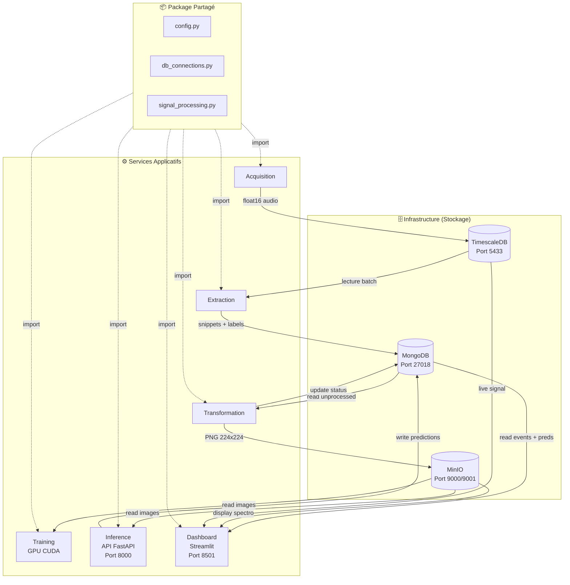

# 🔍 Audit du Projet "The Bubble Project"

**Version** : Architecture v2.1 (Optimisation Temps Réel)

## ✅ Problèmes Résolus (Janvier 2026)

### 1. Stabilité Flux Temps Réel
*   **Problème**: L'extraction bouclait à l'infini ("Tentative X/10") en cas de gap partiel de données (chunk incomplet pour toujours).
*   **Solution**: Correction de la logique de reset du compteur de retry et implémentation d'une **détection de gap temporel** robuste.
    *   Si donnée manquante > 10 tentatives : Saut automatique au temps présent.
    *   Démarrage optimisé : Si aucun checkpoint, démarrage à `NOW - 30s` (évite le scan historique).

### 2. Performance Dashboard
*   **Problème**: Rafraîchissement saccadé toutes les 10s et blocage UI.
*   **Solution**:
    *   Réduction `BATCH_DURATION` extraction : **10s ➔ 1s**.
    *   Timeout API Inference : **5s ➔ 0.5s**.
    *   Désactivation de la boucle d'inférence en arrière-plan (inutile).

---

## 📋 Table des Matières

1. [Résumé Exécutif](#résumé-exécutif)
2. [Architecture Globale](#architecture-globale)
3. [Analyse par Service](#analyse-par-service)
4. [Qualité du Code](#qualité-du-code)
5. [Points Forts](#-points-forts)
6. [Axes d'Amélioration](#️-axes-damélioration)

---

## Résumé Exécutif

Le **Bubble Project** est une architecture micro-services pour la **détection de taux de bouchage industriel** via l'analyse acoustique de bulles simulées.

| Critère | Évaluation | Commentaire |
|---------|------------|-------------|
| **Maturité** | ⭐⭐⭐⭐☆ | Services ML fonctionnels |
| **Architecture** | ⭐⭐⭐⭐⭐ | Package common centralisé |
| **Qualité Code** | ⭐⭐⭐⭐☆ | Code factorisé, sans duplication |
| **MLOps** | ⭐⭐⭐☆☆ | API Inference + GPU |
| **Production-Ready** | ⭐⭐⭐☆☆ | Tests unitaires présents |

---

## Architecture Globale

### Diagramme des Services



### Stack Technologique

| Couche | Technologie | Version |
|--------|-------------|---------|
| **Séries Temporelles** | TimescaleDB | latest-pg14 |
| **Document Store** | MongoDB | latest |
| **Object Storage** | MinIO | latest |
| **ML Framework** | PyTorch | 2.1.0 + CUDA 12.1 |
| **API Inference** | FastAPI | via uvicorn |
| **Dashboard** | Streamlit | latest |
| **Orchestration** | Docker Compose | 3.8 |

---

## Analyse par Service

### 1. Package Common (`services/common/`)

Centralise le code partagé entre tous les services.

| Module | Contenu |
|--------|---------|
| `config.py` | Constantes (SAMPLE_RATE, IMG_SIZE), classes de config (Timescale, Mongo, MinIO) |
| `db_connections.py` | Fonctions de connexion avec retry et backoff |
| `signal_processing.py` | `generate_signal()`, `insert_batch()`, `is_db_populated()` |

---

### 2. Service Acquisition

**Fichiers** : `main.py`, `Dockerfile`, `requirements.txt`

**Fonctionnalités** :
- Génération de signaux audio simulés (5 niveaux de bouchage)
- Insertion en batch dans TimescaleDB
- Utilisation du package `common` pour les constantes et connexions

---

### 3. Service Extraction

**Fichiers** : `main.py`, `Dockerfile`, `requirements.txt`

**Fonctionnalités** :
- Détection de bursts acoustiques dans le flux audio
- Découpage et extraction des snippets
- Stockage des événements dans MongoDB

---

### 4. Service Transformation

**Fichiers** : `main.py`, `utils.py`, `Dockerfile`, `requirements.txt`

**Fonctionnalités** :
- Conversion audio → spectrogramme PNG (224×224)
- Upload vers MinIO avec backpressure (retry exponentiel)
- Mise à jour du statut dans MongoDB

---

### 5. Service Training

**Fichiers** : `main.py`, `utils.py`, `Dockerfile`, `requirements.txt`

**Fonctionnalités** :
- Entraînement MobileNetV2 sur GPU CUDA
- Image Docker `pytorch/pytorch:2.1.0-cuda12.1-cudnn8-runtime`
- API PyTorch 2.x (`torch.amp.autocast("cuda")`, `GradScaler("cuda")`)
- Dataset personnalisé `BubbleDataset` avec transforms

---

### 6. Service Inference

**Fichiers** : `main.py`, `utils.py`, `Dockerfile`, `requirements.txt`

API REST pour les prédictions en temps réel.

| Endpoint | Description |
|----------|-------------|
| `GET /health` | État du service et du modèle |
| `GET /predict/{bubble_id}` | Prédiction on-demand |

**Fonctionnalités** :
- Chargement du modèle au démarrage
- Background polling MongoDB pour inférence automatique
- Support GPU CUDA

---

### 7. Service App (Dashboard)

**Fichiers** : `main.py`, `utils.py`, `Dockerfile`, `requirements.txt`

**Fonctionnalités** :
- Visualisation du signal audio en temps réel
- Affichage des spectrogrammes depuis MinIO
- Prédictions avec comparaison ground truth (vert/rouge)

---

## Qualité du Code

| Métrique | État |
|----------|------|
| **Duplication** | ❌ Aucune |
| **Package partagé** | ✅ `common/` |
| **Tests unitaires** | ✅ 9 tests |
| **Services ML** | ✅ Fonctionnels |
| **API REST** | ✅ FastAPI |

---

## ✅ Points Forts

1. **Package Common** : Code centralisé, maintenance simplifiée
2. **API Inference** : FastAPI avec background polling automatique
3. **GPU Support** : Training et Inference optimisés CUDA
4. **Backpressure** : Retry exponentiel sur MinIO
5. **Tests** : Couverture des fonctions critiques
6. **PyTorch 2.x** : API modernes, pas de deprecation warnings

---

## ⚠️ Axes d'Amélioration

| Aspect | État Actuel | Recommandation |
|--------|-------------|----------------|
| Observabilité | Non implémentée | Prometheus + Grafana |
| Sécurité | Mots de passe en .env | HashiCorp Vault |
| CI/CD | Aucun | GitHub Actions |
| Message Queue | Polling DB | RabbitMQ/Kafka |
| Model Registry | Aucun | MLflow |

---

## Structure du Projet

```
classification_bubbles/
├── .env                          # Variables d'environnement (NON versionné)
├── .env.example                  # Template (versionné)
├── docker-compose.yml            # Orchestration 9 services
├── README.md                     # Documentation principale
├── STORAGE.md                    # Documentation stockage
├── audit.md                      # [CE FICHIER]
├── requirements-dev.txt          # Dépendances tests
├── models/                       # Modèles entraînés (volume)
├── tests/                        # Tests unitaires
├── init-scripts/
│   └── timescale_init.sql
└── services/
    ├── common/                   # Package partagé
    │   ├── __init__.py
    │   ├── config.py
    │   ├── db_connections.py
    │   └── signal_processing.py
    ├── acquisition/              # Générateur de signaux
    ├── extraction/               # Détection de pics
    ├── transformation/           # Spectrogrammes
    ├── training/                 # Entraînement ML (GPU)
    ├── inference/                # API FastAPI
    └── app/                      # Dashboard Streamlit
```
