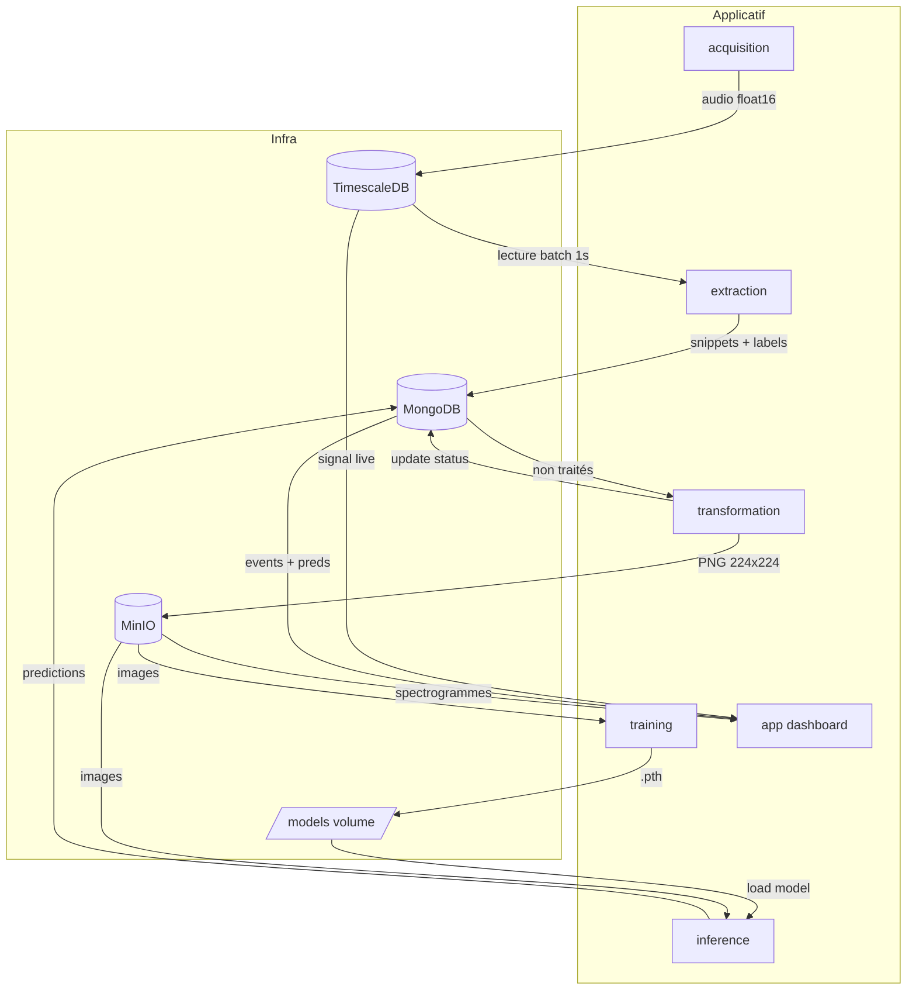

# Architecture — The Bubble Project

## 1. Vue d'ensemble

Le projet est un pipeline **micro-services** qui simule une usine, génère des signaux
acoustiques de bulles pour **5 niveaux de bouchage** (0/20/40/60/80 %), les stocke, les
transforme en spectrogrammes, entraîne un classifieur **MobileNetV2** et affiche les
prédictions en temps réel dans un dashboard Streamlit. L'ensemble tourne sous **Docker
Compose** avec **10 services** (4 d'infrastructure, 6 applicatifs) sur un unique réseau
bridge.

Le flux principal est linéaire : **Acquisition → TimescaleDB → Extraction → MongoDB →
Transformation → MinIO → Training / Inference → MongoDB → Dashboard**.

---

## 2. Services / Composants

Les valeurs (images, ports) sont lues dans [docker-compose.yml](../docker-compose.yml) et
[.env.example](../.env.example). Les ports hôte des stores viennent des variables `.env`
(défauts ci-dessous).

| Service | Image / Build | Port interne | Port hôte | Rôle |
|---|---|---|---|---|
| `timescale_db` | `timescale/timescaledb:latest-pg14` | `5432` | `5433` | Séries temporelles (audio brut décimé) |
| `mongo_db` | `mongo:latest` | `27017` | `27018` | Feature store (événements + prédictions) |
| `minio-db` | `minio/minio:latest` | `9000` / `9001` | `9000` / `9001` | Data lake objet (spectrogrammes PNG) |
| `minio_init` | `minio/mc` | — | — | Crée et rend public le bucket `spectrograms`, puis s'arrête |
| `acquisition` | `services/acquisition/Dockerfile` (python:3.10-slim) | — | — | Génère les signaux et alimente TimescaleDB |
| `extraction` | `services/extraction/Dockerfile` (python:3.10-slim) | — | — | Détecte les bursts et écrit les événements dans MongoDB |
| `transformation` | `services/transformation/Dockerfile` (python:3.10-slim) | — | — | Audio → spectrogramme PNG 224×224 → MinIO |
| `training` | `services/training/Dockerfile` (pytorch:2.1.0-cuda12.1) | — | — | Entraîne MobileNetV2 sur GPU (profil `training`) |
| `inference` | `services/inference/Dockerfile` (pytorch:2.1.0-cuda12.1) | `8000` | `8000` | API FastAPI + polling de prédiction |
| `app` | `services/app/Dockerfile` (python:3.10-slim) | `8501` | `8501` | Dashboard Streamlit temps réel |

Fiches détaillées des services applicatifs : [services/](services/). Détail des stores :
[STORAGE.md](../STORAGE.md).

---

## 3. Stack technologique

Versions lues dans les `Dockerfile` et `requirements.txt`. Les dépendances Python sont
non épinglées sauf mention contraire.

| Couche | Technologie | Version |
|---|---|---|
| Séries temporelles | TimescaleDB (PostgreSQL 14) | `latest-pg14` |
| Document store | MongoDB | `latest` |
| Object storage | MinIO | `latest` |
| Runtime services CPU | Python | 3.10-slim |
| Framework ML | PyTorch (image CUDA) | 2.1.0 / CUDA 12.1 / cuDNN 8 (image) ; `torch>=2.0.0` (requirements) |
| Vision | torchvision | `>=0.15.0` |
| API d'inférence | FastAPI + Uvicorn | non épinglé |
| Dashboard | Streamlit | non épinglé |
| Traitement du signal | NumPy, SciPy | non épinglé |
| Orchestration | Docker Compose | fichier sans clé `version` (schéma Compose récent) |

---

## 4. Flux de bout en bout

1. **Acquisition** génère l'audio (44 100 Hz), décime x11 (~4009 Hz) et insère
   `(time, amplitude, label)` dans TimescaleDB (`audio_data`).
2. **Extraction** lit TimescaleDB par blocs de **1,0 s**, détecte les pics
   (`scipy.signal.find_peaks`, seuil `0.3`), découpe des snippets de **0,2 s** et les écrit
   dans MongoDB (`bubbles`, `processed=false`).
3. **Transformation** lit les bulles non traitées, calcule un spectrogramme
   (`nperseg=256`, `noverlap=128`), le convertit en PNG 224×224 (LANCZOS), l'envoie sur
   MinIO (bucket `spectrograms`) et repasse le document à `processed=true`.
4. **Training** (profil `training`) charge les images depuis MinIO, entraîne MobileNetV2 et
   écrit `models/bubble_classifier.pth`.
5. **Inference** charge le modèle, poll MongoDB et écrit la `prediction` dans chaque
   document. Expose aussi `/predict/{bubble_id}` à la demande.
6. **Dashboard** lit TimescaleDB (signal live), MongoDB (événements + prédictions) et MinIO
   (spectrogrammes) pour la visualisation.

Le **package `common`** ([services/common/](../services/common/)) est importé par tous les
services applicatifs : constantes de traitement, `BUBBLE_PARAMS`, classes de config DB et
fonctions de connexion avec retry.

---

## 5. Réseaux & volumes

| Réseau | Services | Rôle |
|---|---|---|
| `bubble_net` (bridge) | tous | Réseau interne unique ; les services se joignent par nom DNS Docker (`timescale_db`, `mongo_db`, `minio-db`) |

| Volume | Monté par | Contenu |
|---|---|---|
| `timescale_data` | `timescale_db` | `/var/lib/postgresql/data` |
| `mongo_data` | `mongo_db` | `/data/db` |
| `minio_data` | `minio-db` | `/data` (objets) |
| `./models` (bind) | `acquisition`, `training`, `inference`, `app` | `/app/models` : modèle `.pth` + fichiers de progression |

---

## 6. Décisions d'architecture

- **Stockage polyglotte** : TimescaleDB **plutôt qu'**une seule base généraliste, **parce
  que** l'ingestion massive horodatée et la politique de rétention 24 h sont natives ;
  MongoDB pour la souplesse de schéma des événements ; MinIO pour les binaires PNG que les
  bases relationnelles gèrent mal. *Limite* : trois stores à opérer au lieu d'un.
- **MongoDB comme file d'attente** : polling des documents `processed=false` / `prediction
  absent` **plutôt qu'**un broker (RabbitMQ/Kafka), **parce que** cela évite un composant de
  plus pour un pipeline mono-instance. *Limite* : latence liée à l'intervalle de polling,
  pas de garantie de livraison exactly-once.
- **Décimation x11 à l'acquisition** : ~4009 Hz stocké **plutôt que** 44 100 Hz, **parce
  que** Nyquist à 2000 Hz couvre les bulles (≤ 1200 Hz) et divise le volume par 11.
  *Limite* : perte des composantes hautes fréquences (non pertinentes ici).
- **MobileNetV2 pré-entraîné** : transfer learning **plutôt qu'**un CNN entraîné de zéro,
  **parce que** le jeu est petit et la convergence plus rapide. *Limite* : biais des poids
  ImageNet sur des spectrogrammes, hors distribution naturelle.
- **Signal stochastique chevauchant** : distributions gaussiennes par classe **plutôt que**
  des points fixes, **parce qu'**un signal trivialement séparable faisait converger le CNN à
  ~100 % sans rien apprendre (voir [audit.md](../audit.md)). *Limite* : plus de réalisme au
  prix d'une précision de validation plus basse.
- **GPU réservé à Training et Inference** : réservation `nvidia` **plutôt que** CPU,
  **parce que** l'entraînement et l'inférence CNN en profitent ; les autres services restent
  en `python:3.10-slim`. *Limite* : nécessite les drivers NVIDIA (WSL) côté hôte.

---

## 7. Sécurité (récapitulatif)

Détail complet : [SECURITY.md](SECURITY.md).

| Durcissement | État |
|---|---|
| Secrets dans `.env` non versionné (`.gitignore`) | ✅ |
| Bucket `spectrograms` en accès anonyme public | ❌ (ouvert par conception démo) |
| Isolation réseau `bubble_net` (stores non exposés sauf ports mappés) | ✅ ports de dev mappés sur l'hôte |
| Conteneurs non-root | ❌ (images par défaut) |

---

## 8. Limites connues & pistes

Reprises de [audit.md](../audit.md).

| Aspect | Limitation / État | Recommandation |
|---|---|---|
| Observabilité | Non implémentée | Prometheus + Grafana |
| Gestion des secrets | Mots de passe en clair dans `.env` | Coffre (Vault) en production |
| CI/CD | Aucun | GitHub Actions |
| File de messages | Polling MongoDB | RabbitMQ / Kafka |
| Model registry | Aucun (fichier `.pth` sur volume) | MLflow |
| Dépendances Python | Non épinglées (sauf `torch`) | Lockfile / versions figées |
