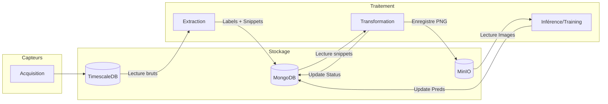

# Documentation du Stockage (Storage)

Le Bubble Project utilise une architecture de stockage polyglotte pour répondre aux différents besoins de performance et de structure des données.

## 1. TimescaleDB (Séries Temporelles)
**Rôle** : Stockage des signaux acoustiques bruts décimés.
- **Pourquoi ?** Optimisé pour l'ingestion massive de données horodatées et les requêtes analytiques sur le temps.
- **Structure** : Table `audio_data` avec hypertable activée sur la colonne `time`.
- **Rétention** : Les données brutes sont destinées à être nettoyées périodiquement après traitement.

## 2. MongoDB (Document / Métadonnées)
**Rôle** : Indexation des événements acoustiques détectés.
- **Pourquoi ?** Flexibilité pour stocker des snippets audio sous forme de listes, des labels, des résultats d'inférence et des chemins de fichiers sans schéma rigide.
- **Usage** : Sert de file d'attente de message entre les services d'Extraction, Transformation et Inférence.

## 3. MinIO (Stockage d'Objets)
**Rôle** : Stockage des spectrogrammes (images PNG).
- **Pourquoi ?** Les bases de données ne sont pas adaptées au stockage de fichiers binaires volumineux. MinIO offre une API compatible S3 performante.
- **Structure** : Bucket `spectrograms`.
- **Accès** : Les images sont servies au dashboard via des requêtes directes au bucket.

---

## Schéma des Interactions

## Volumes Docker
Pour garantir la persistance des données entre les redémarrages des conteneurs, les volumes suivants sont définis :
- `timescale_data`
- `mongo_data`
- `minio_data`
